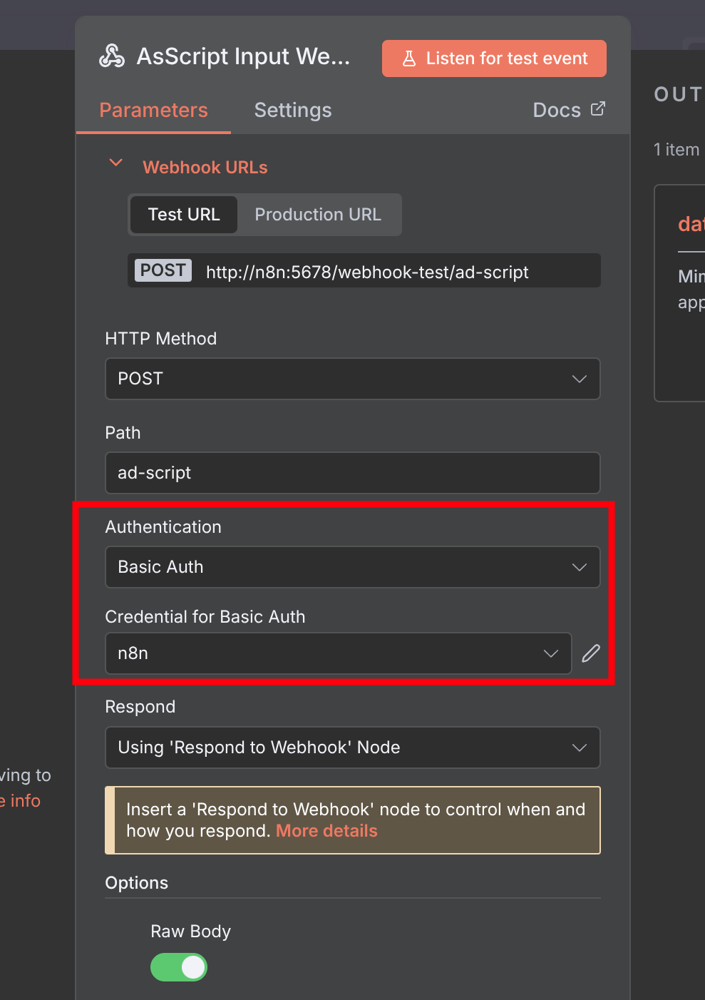
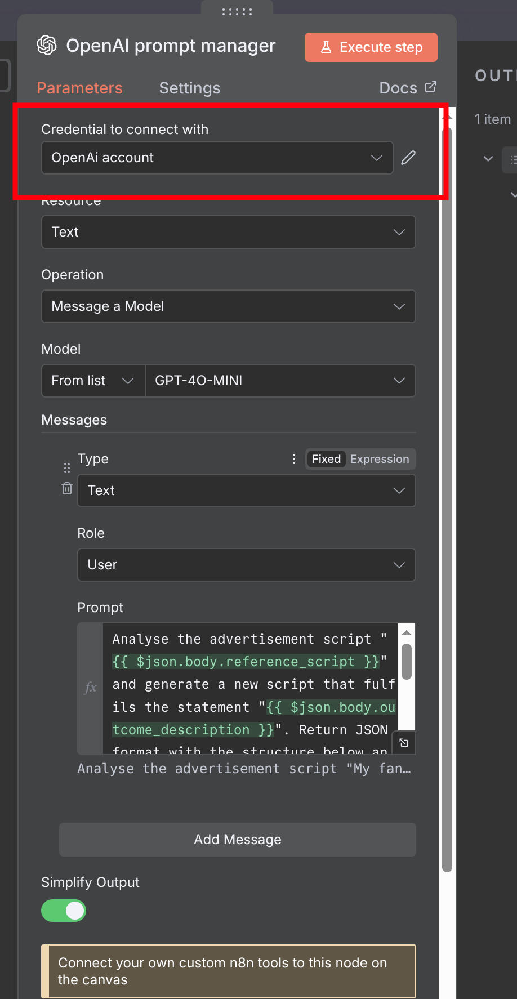
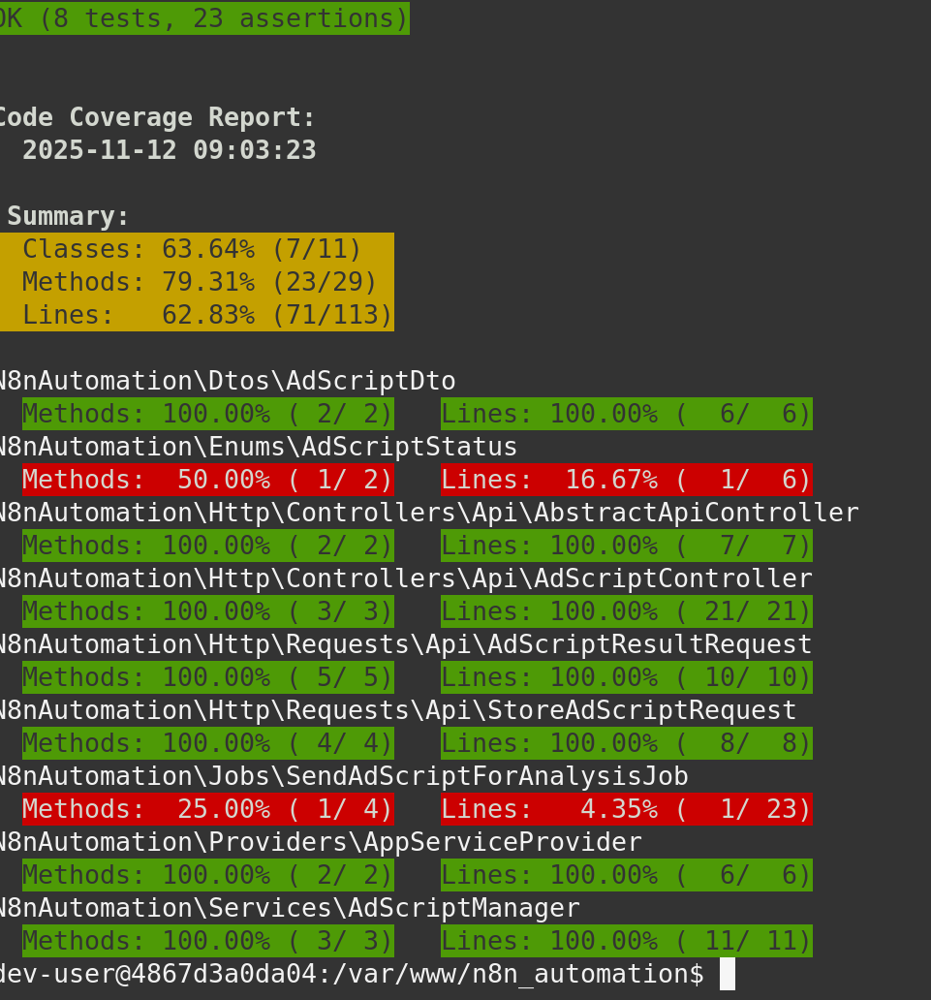

# N8N Automation

## 📋 Table of Contents

- [Prerequisites](#prerequisites)
- [Installation](#installation)
- [Configuration](#configuration)
- [N8N Workflow Setup](#n8n-workflow-setup)
- [Code Coverage](#code-coverage)

---

## Prerequisites

- Docker and Docker Compose
- Make (build automation tool)

---

## Installation

### 1. Environment Setup

Copy the environment example file and configure your credentials:

```bash
cp .env.example .env
```

**⚠️ Important:** Update the following values in your `.env` file:
- Passwords
- API Keys
- `STORE_BEARER_TOKEN`
- `N8N_BEARER_TOKEN`
- All `notSecureReplaceMe` values

> **Note:** The code will work with default values, but it won't be secure for production use.

### 2. Start Docker Containers

```bash
make docker-start
```

### 3. Connect to Server

```bash
make ssh
```

### 4. Initialize Laravel Application

Run the following commands inside the container:

```bash
php artisan key:generate
php artisan migrate --force
```

---

## N8N Workflow Setup

### Import Workflow

1. Access N8N at [http://localhost:5678](http://localhost:5678)
2. Import the workflow file: [AdScriptN8n.json](AdScriptN8n.json)

### Configure Webhook Authentication

Set up Basic Auth credentials for the webhook using these environment variables:
- `N8N_AD_SCRIPT_WEBHOOK_USERNAME`
- `N8N_AD_SCRIPT_WEBHOOK_PASSWORD`

**Configuration Example:**



### Configure OpenAI Integration

Add your OpenAI credentials to the prompt manager node:



---

## Code Coverage

Current test coverage statistics:



